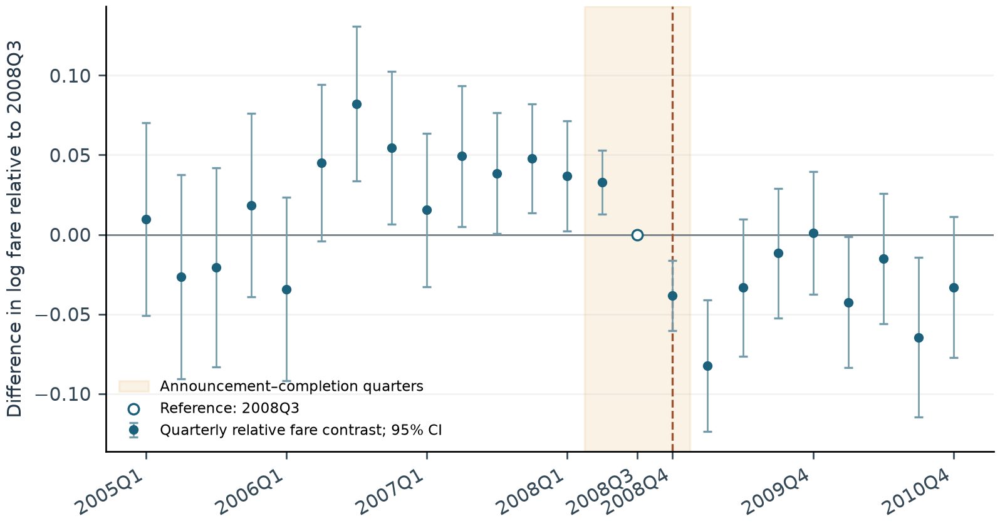

# Assessing Fare Changes After the Delta–Northwest Merger

**Xuange (Adora) Chen · Writing sample and reproducible analysis · September 2026**

How did fares on routes with pre-merger Delta–Northwest overlap change relative to comparison routes? This project uses 2005–2010 aggregate airline data to build passenger-weighted market fares, estimate relative changes, and examine whether the comparison supports a causal interpretation.

[**Read the writing sample**](papers/writing_sample.pdf) · [Technical supplement](papers/technical_supplement.pdf) · [Download original dataset](https://github.com/adoraxuangechen/airline-merger-fare-analysis/releases/download/writing-sample-2026-09/DB1B_2005_2010.csv.gz) · [Portfolio](https://xuangechen.com/)

## Main finding

In the main sample of **156 overlap routes and 105 comparison routes**, fares on overlap routes exhibit an estimated **5.72% relative decline** from 2008Q4 onward. The route- and quarter-fixed-effects coefficient is −0.05890 (route-clustered SE 0.01889; 6,259 route-quarter observations). The transformed 95% interval is [−9.16%, −2.15%].

This is a **descriptive relative change, not a credible standalone estimate of the merger's causal effect**. The groups' relative fare paths already differ before the announcement: a separate 2005–2007 event study rejects joint equality of its pre-reference coefficients (F(11,260) = 7.46, p < 0.001). Differences in route composition, demand exposure and service mix remain important. A fare-only analysis also cannot identify changes in passenger welfare.



The open point at 2008Q3 is the omitted reference quarter, fixed at zero by construction. Other points compare the overlap–comparison log-fare gap with that quarter's gap. The figure does not measure either group's absolute fare change; its intervals are pointwise, not simultaneous bands.

Changing the sample definition changes the population being compared:

| Sample definition | Overlap routes | Comparison routes | Estimated relative change |
|---|---:|---:|---:|
| Main: material single-carrier overlap in 2007; unexposed legacy comparison | 156 | 105 | −5.72% |
| Any DL/NW carrier-code presence during 2007; legacy comparison | 3,706 | 1,379 | −1.23% |
| Broad pre-closing presence; legacy comparison | 8,180 | 6,424 | +0.80% |
| Broad pre-closing presence; all other pre-observed routes | 8,180 | 23,664 | +1.54% |

These rows are not interchangeable estimates of one fixed population. The broader rules count any appearance in either operating-carrier field and need not establish simultaneous independent service. Full eligibility and comparison-group definitions appear in the supplement and [analysis methods](analysis/README.md); exact results are in [regression_results.csv](results/regression_results.csv).

## Data and construction

The original project input is now available as a **GitHub Release asset**, compressed without changing its contents. The 50.25 MiB gzip archive expands to the original `DB1B_2005_2010 copy.csv` (200,700,593 bytes, 4,175,354 records). The verification script checks the SHA256 of both files before using them.

This is a **pre-aggregated extract**, not raw individual DB1B tickets. Each record identifies an operating-carrier set, an **unordered airport pair**, a quarter and a one-/two-coupon category, with sampled passenger count and mean one-way-equivalent fare. Market fare is `sum(pax × avprc) / sum(pax)` across all retained cells in that market-quarter. The analysis takes logs after aggregation and gives each route-quarter equal regression weight in the main specification.

An independent row-by-row comparison with the public Borenstein/NBER archive matched all 4,175,354 records' numeric and airport values within 5.01 × 10⁻¹². It also identified **42 literal carrier-code `NA` entries already converted to blanks** in the supplied CSV (34 records). The original file is preserved, and the analysis retains those records in fare totals. This audit verifies the aggregate extract's relationship to the archive; it does not independently reconstruct upstream ticket screening.

The cleaning rules remove four same-airport records and no other rows from this input. The main sample then requires all four quarters of 2007 with at least 100 sampled passengers per quarter. Treatment requires DL and NW each to have at least 5% single-carrier passenger share in the same three or four quarters. Comparison routes have no DL/NW presence in 2007 and at least 5% combined single-carrier share from AA, AS, CO, UA, US and HP in at least three quarters. Classification remains fixed afterwards.

Data definitions and attribution: [Severin Borenstein's Market Data documentation](https://faculty.haas.berkeley.edu/borenste/mktdata.htm), [NBER dataset page](https://www.nber.org/research/data/department-transportation-db1adb1b), [DOI: 10.60592/tb1p-9p78](https://doi.org/10.60592/tb1p-9p78). See [data/README.md](data/README.md) and [provenance/README.md](provenance/README.md).

## Reproduce the results

Python 3.12 is the verified version. From the repository root:

```sh
python -m venv .venv
source .venv/bin/activate
python -m pip install -r requirements.txt
python scripts/download_and_verify.py
python analysis/run_analysis.py --input "data/DB1B_2005_2010 copy.csv" --out results_recheck --printed-b1 analysis/original_table_b1_transcribed.csv
```

On Windows, activate the environment with `.venv\Scripts\activate` in place of the `source` command. The download/extraction step uses only Python's standard library. Alternatively, download the release asset manually into `data/` and run the same verification script; an existing verified CSV is left unchanged.

The analysis reads the CSV without modifying it and writes all panels, classifications, tables and figures to the selected output directory. `results_recheck/` keeps a rerun separate from the committed results. A full run loads the 4.18 million-row file and constructs additional all-market panels, so it needs more memory and disk space than the small published main panel. No proprietary software or API key is required.

Expected main results:

- Coefficient: **−0.0588984578886**; route-clustered SE: **0.0188886523421**.
- Main sample: **261 routes, 6,259 route-quarters**.
- Clean input: **4,175,350 records**; 2007-eligible pool: **5,535 routes**.
- Input SHA256: `68822d60114c61af9f6ce8d9084aa20276f0d5b1b64a9a80b0e372929f1d19cb`.

A complete run has been performed on the supplied CSV. Included checks compare coefficients and clustered standard errors from the absorbed estimator with explicit route/quarter dummy OLS and WLS on an actual-data subset containing unbalanced markets. The event-study checks cover every quarterly coefficient and standard error. Passenger totals, weighted fare sums, panel keys and specified sample transitions are also checked. See [results/results.json](results/results.json) for numerical validation output.

## Files

| Location | Contents |
|---|---|
| `papers/` | Main writing sample and English technical supplement, including editable and text versions |
| `analysis/` | Complete analysis pipeline, detailed cleaning/estimation documentation and original Table B1 transcription |
| `data/` | Dataset metadata and source attribution; the full compressed original is linked as a Release asset |
| `documents/` | Source templates and DOCX builder; [rebuild instructions](documents/README.md) |
| `scripts/` | Download, checksum verification and exact extraction |
| `results/` | Main analysis panel, route classifications, audit counts, estimates, event coefficients and figures |
| `provenance/` | Source-archive comparison script and reports, carrier-code discrepancies and primary sources |

The two large all-market intermediate panels are generated by the pipeline and omitted from Git. The small main analysis panel and saved results are included. Earlier root-level scripts are retired entry points; `run_analysis.py` at the root forwards to the current pipeline.

## Relation to earlier versions

The audited original implementation produced approximately +5.13%. Correcting its fixed-effects calculation while holding observations, outcome and groups unchanged gives approximately +5.02%; further changes to fare aggregation, eligibility and group definitions lead to the current −5.72%. The [sequential comparison](results/specification_bridge.csv) makes these changes explicit. It is order-dependent and should not be described as a sign reversal caused by one coding fix.

The original Figure 2 can be reproduced from the supplied code. The original Table B1's printed coefficients and standard errors cannot be matched at their printed precision; the comparison is saved in [original_table_b1_comparison.csv](results/original_table_b1_comparison.csv). The current writing sample uses the verified pipeline and reports its own results. The supplement preserves useful technical and literature context while keeping the main sample focused on the economic question.
